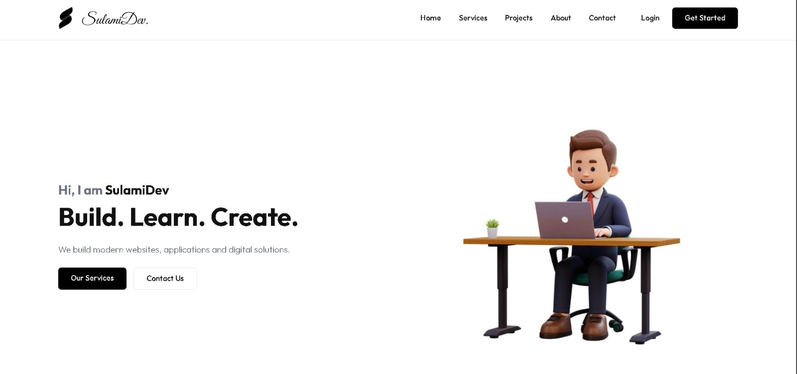
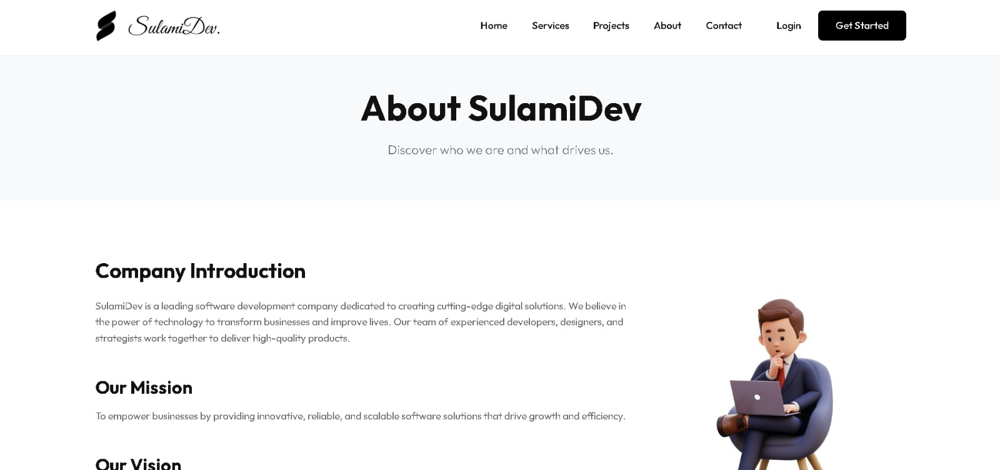
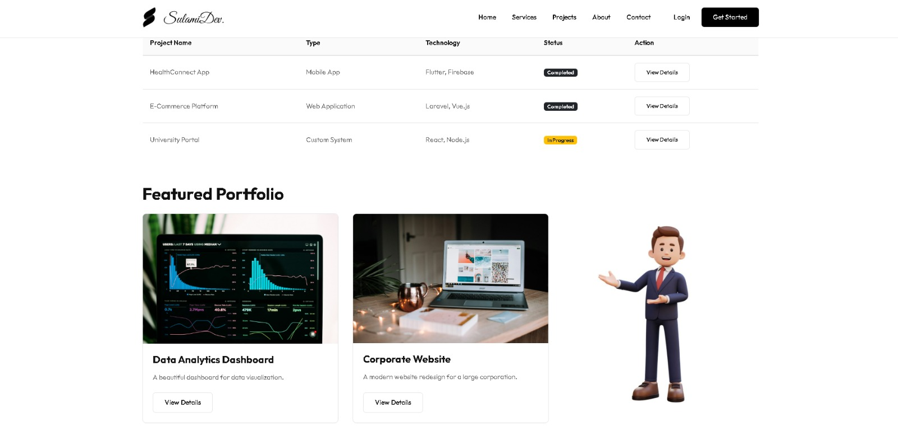
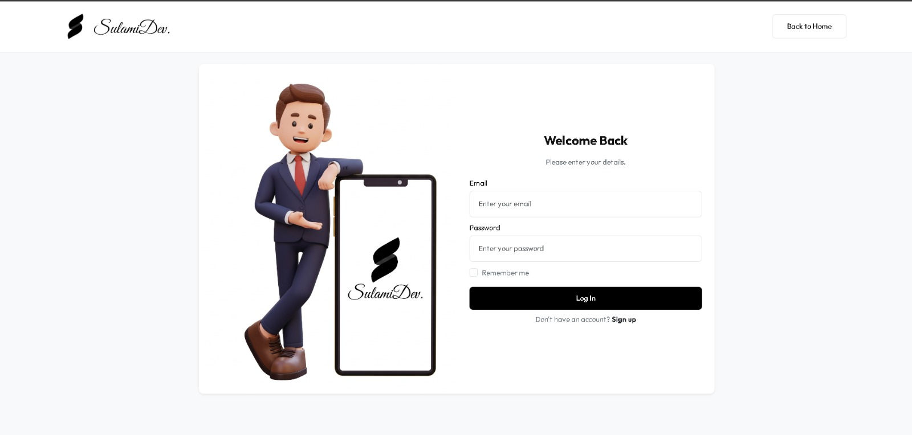

# SulamiDev — Frontend Portfolio

> **This is a purely Front-End project.**  
> No backend, no database — just HTML, CSS, and JavaScript.

---

## 🌐 About

**SulamiDev Portfolio** is the official company portfolio website for **SulamiDev**, showcasing the services, projects, and identity of the company.

The site is designed to be fast, responsive, and visually engaging — built entirely with modern front-end technologies.

---

## 🛠️ Tech Stack

| Technology | Purpose |
|---|---|
| HTML5 | Page structure & semantics |
| CSS3 / Vanilla CSS | Styling & responsive layout |
| JavaScript (Vanilla) | Interactivity & dynamic behavior |
| Bootstrap 5 | UI components & grid system |
| Font Awesome 6 | Icons |

---

## 📁 Project Structure

```
SulamiDev/
├── index.html          # Homepage
├── pages/
│   ├── about.html      # About Us
│   ├── services.html   # Services
│   ├── projects.html   # Projects / Portfolio
│   ├── contact.html    # Contact
│   ├── login.html      # Login
│   └── register.html   # Register
├── css/
│   ├── style.css       # Main stylesheet
│   └── responsive.css  # Responsive styles
├── js/
│   └── main.js         # Main JavaScript
├── images/             # Image assets
├── components/         # Reusable HTML components
├── libs/               # Local vendor libraries (offline fallback)
└── data/               # Static data files
```

---

##  Screenshots

###  Homepage


### About


### Projects


### Login


---

##  Getting Started

Since this is a **static front-end project**, there is no build step required.

### Run Locally

Simply open the project in your browser:

```bash
# Option 1 — Open directly
start index.html

# Option 2 — Use a local server (recommended)
npx serve .
# or
python -m http.server 8080
```

Then visit: `http://localhost:8080`

---

## 📄 Pages

| Page | Description |
|---|---|
| `index.html` | Main landing / homepage |
| `pages/about.html` | Company information |
| `pages/services.html` | Services offered by SulamiDev |
| `pages/projects.html` | Portfolio of work |
| `pages/contact.html` | Contact form & details |

---

##  About SulamiDev

**SulamiDev** is a software development company focused on delivering high-quality digital solutions including:

- 🌐 Web Development
- 📱 Mobile Applications
- 🏢 Corporate Software Solutions

---

##  License

This project is proprietary to **SulamiDev**. All rights reserved.

---

<p align="center">
  Made with ❤️ by <strong>SulamiDev</strong>
</p>
